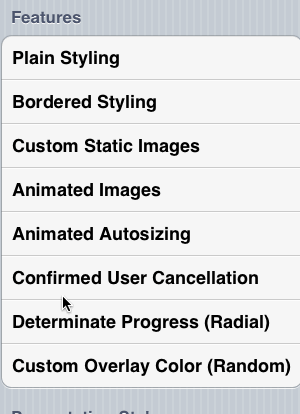
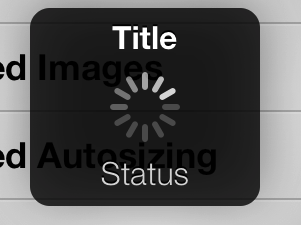

MMProgressHUD
==============

An easy-to-use HUD interface with personality.

It would be a shame for Mutual Mobile's in-house HUD interface to not be shared with the world. Now available for everyone!

<p align="center" >

</p>

MMProgressHUD is a part of Mutual Mobile's growing suite of open-source Objective-C projects:

- [MMRecord](https://github.com/mutualmobile/MMRecord)
- [MMDrawerController](https://github.com/mutualmobile/MMDrawerController)

##Dead-Simple Implementation
Use the shared instance of `MMProgressHUD` through either the `+sharedHUD` class method or through the other suite of class convenience methods available.

Usage of MMProgressHUD can be accomplished in a single line of code:

```` objc
[MMProgressHUD showWithTitle:@"Loading..." status:@"25%"];
````

Dismissing can be done in a number of ways and is just as simple:

```` objc
/** Do some work asynchronously */

void (^completion)(void) = ^(){
    [MMProgressHUD dismissWithSuccess:@"Completed!"];
}
````

No parent views to specify -- nothing else to think about.

### Customization
Customizations on the look and feel of MMProgressHUD are optional and can be performed once during the lifetime of your application. These are shown below in the [Setup](#setup) section.

##Installation
Use cocoapods for installation: `pod 'MMProgressHUD'`

###Manual Install
If you really insist on doing things the hard way, simply include all of the files in the `Source/` folder in the repository in your project. If you don't already have it in your project, you'll need to link against the QuartzCore and CoreGraphics frameworks.

##Features
###Animations
The primary motivation for building MMProgressHUD was to be able to easily add fun animations as they were needed. MMProgressHUD has several presentation/dismiss animation styles depending on what you are looking for:

1. **Drop** - When presented, the HUD drops from above the screen and hangs as if it were pinned on it's top corners to the top corners of the screen with string. The initial angle and constants for the keyframe animation are random so no two presentations look exactly the same. On dismissal, HUD falls as if both strings had been cut.
2. **Expand** - Presentation begins with the HUD very small, scaling larger to the final size with a small bounce. Dismissal begins with a small bounce around the original size up to a very large size.
3. **Shrink** - Presentation begins with the HUD much larger than reality, scaling smaller to the final size with a small bounce. Dismissal shrinks from the HUD's original size down to a small point with an alpha fade and a small initial bounce.
4. **Balloon** - Presentation begins below the screen with the HUD floating up from the bottom as if it were a balloon being let go into the air and hanging at the end of its string. Dismissal acts as if the string holding the balloon were cut and the HUD floats off the top of the screen.
5. **Fade** - Your standard alpha fade in/out.

Use `+ (void)setPresentationStyle:(MMProgressHUDPresentationStyle)presentationStyle;` to modify the presentation animation.

###No Assets
MMProgressHUD uses CoreGraphics-drawn images for the default images. This makes it very easy to drop-in all the files to your project without having to specify bundles and other assets to copy. Just include the source and you're good to go.

###Full-Screen
MMProgressHUD is window-based, so it will display the overlay above the status bar. This means that MMProgressHUD does not muck with your view hierarchies and will stay self-contained in its own window. MMProgressHUD does not make itself the key window at any point during presentation.

###Autosizing
MMProgressHUD supports almost arbitrary text content. As a matter of design and clutter, you probably shouldn't put too much text into a HUD, but MMProgressHUD will intelligently lay itself out depending on your text content. Changing the text and image content while the HUD is displayed will initiate an animation between the two states. This animation is very fast, yet not instantaneous in order to provide context of the state change.

###Extremely Basic User Interaction
MMProgressHUD supports extremely basic user input in the form of a confirmation tap from the user to initiate a "cancellation" action. After the user taps the HUD, it will enter a "confirmation" state in which the HUD changes state to let the user know the next tap will initiate some action that you define (see "Completion Blocks" below). For example, use this to let the user cancel a long-running task. The "confirmation" state resets back to the normal HUD state after a given timeout if the user has not confirmed the action. MMProgressHUD looks for a `cancelBlock` when determining whether or not to enter into the "confirmation" state.

```` lang:objective-c
+ (void)showWithTitle:(NSString *)title
               status:(NSString *)status
  confirmationMessage:(NSString *)confirmation
          cancelBlock:(void(^)(void))cancelBlock;
````

###Completion Blocks
Some HUD actions can have an associated block of work attached to them to be fired when the action occurs:

1. `dismissAnimationCompletion` - A block of work that is executed when the HUD dismissal animation is completed.
2. `cancelBlock` - A block of work that is executed when the user cancels a long-running action. When this block is non-nil, the HUD will respond to taps and enter a "confirmation" state on first tap. When a confirmation tap is performed by the user, the HUD is dismissed and this block is fired.
3. `progressCompletion` - A block of work that is executed when the HUD's progress property is fed a value >= 1.f.

###Determinate Progress
By default, MMProgressHUD displays an indeterminate spinner, but it also supports determinate tasks through the progress APIs. Feed MMProgressHUD a progress (`[0,1]`), and it will display a progress indicator visually displaying the task progress to the user.

Currently, both radial and linear progress indicators are provided, with an API to provide an arbitrary determinate progress class that conforms to `MMProgressView`.

```` lang:objective-c
+ (void)showProgressWithStyle:(MMProgressHUDProgressStyle)progressStyle
                        title:(NSString *)title
                       status:(NSString *)status
          confirmationMessage:(NSString *)confirmation
                  cancelBlock:(void (^)(void))cancelBlock;
````

Update the progress HUD with the update APIs:

```` lang:objective-c
+ (void)updateProgress:(CGFloat)progress withStatus:(NSString *)status title:(NSString *)title;
+ (void)updateProgress:(CGFloat)progress withStatus:(NSString *)status;
+ (void)updateProgress:(CGFloat)progress;
````

##Setup
When setting up your instance of MMProgressHUD, you'll need to configure the settings according to the style and behavior you're trying to achieve. You can find the available properties in `MMProgressHUD.h`. These settings will persist across calls of `show` and `dismiss`, so you only have to set them once per instance:

1. `overlayMode` - The type of overlay that displays behind the HUD and over your content.
2. `successImage` - The success image you would like to use for success dismissal. The default image is a white check mark.
3. `errorImage` - The error image you would like to use for error situations. The default image is a white 'X'.
4. `confirmationMessage` - A message to be displayed to the user when a cancelable HUD action is displayed.
6. `presentationStyle` - The behavior animation the HUD performs when presenting and dismissing itself.
7. `glowColor` - The glow color the HUD emits while in the cancellation confirmation state.
8. `progressStyle` - The style that the HUD inherits when the HUD is in determinate progress state.

##Anatomy
MMProgressHUD consists of a window, an overlay view, and the HUD view itself. Since MMProgressHUD is window-based, the overlay will display full-screen over the status bar. The only two pieces of information related to MMProgressHUD's visual anatomy are the text labels:

<!--````
-- MMProgressHUDWindow (UIWindow)
---- MMProgressHUDOverlayView (UIView)
---- MMHud (UIView)
------ titleLabel (UILabel)
------ contentContainer (UIView)
------ statusLabel (UILabel)
```` -->

<p align="center" >

</p>

`titleLabel` - The is the label at the top of the HUD above the content area.  
`statusLabel` - The message label that is displayed at the bottom of the HUD below the center content area. In the absence of title text, this label's font will be the bold variant.

You will never access these label properties directly, but it's useful to know which text will be displayed in which label when using the class convenience methods.

##Contributing
When contributing your modifications back to the rest of the community, please keep a couple of things in mind:

1. Keep changes as concise as possible
2. Please hesitate when adding new methods to the public header
3. Don't remove methods from the public header - provide backward compatibility and deprecation attributes for methods that are deprecated
4. Please exclude modifications that include a large amount of whitespace changes - they are very difficult to diff
5. We want your changes - work with us to help you get them in so that everyone can benefit from your work!

##Author

Created by [Lars Anderson](http://twitter.com/theonlylars) at [Mutual Mobile](http://mutualmobile.com).

##Contributors (Thank you!)

- Hari Karam Singh, [@Club15CC](https://github.com/club15cc) - [#5](https://github.com/mutualmobile/MMProgressHUD/pull/5)
- Jonas Gessner, [@JonasGessner](https://github.com/JonasGessner) - [#3](https://github.com/mutualmobile/MMProgressHUD/pull/3)
- Lucas Vidal, [@LucasVidal](https://github.com/LucasVidal) - [#22](https://github.com/mutualmobile/MMProgressHUD/pull/22)

##License
Standard MIT License
